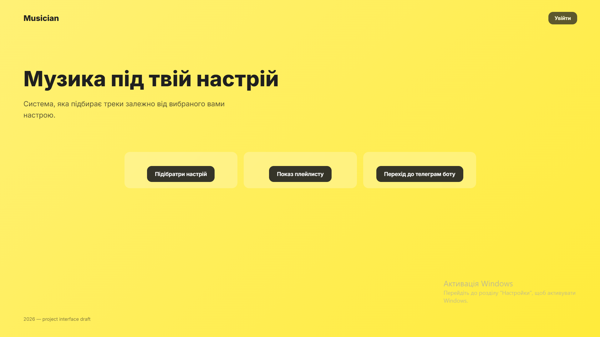
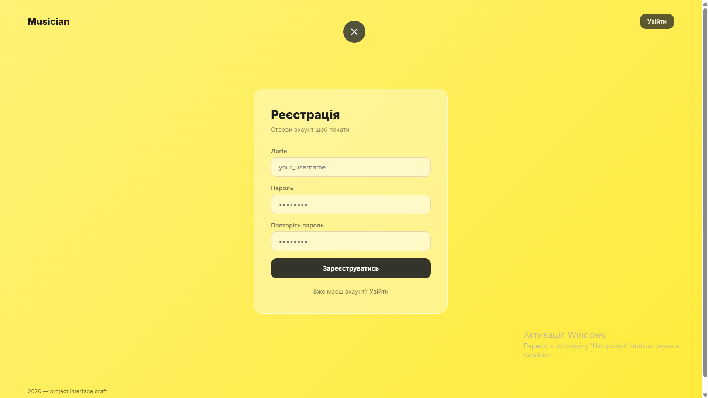
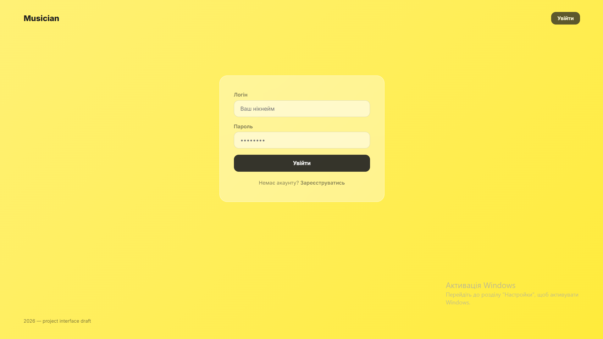
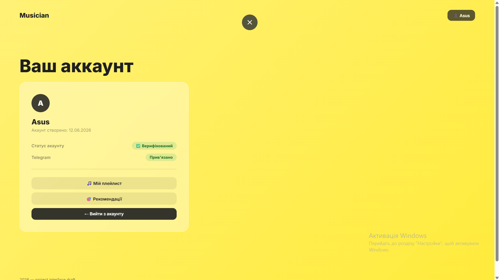
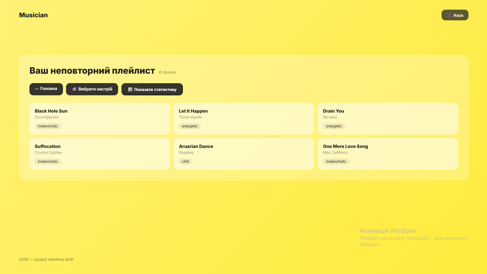
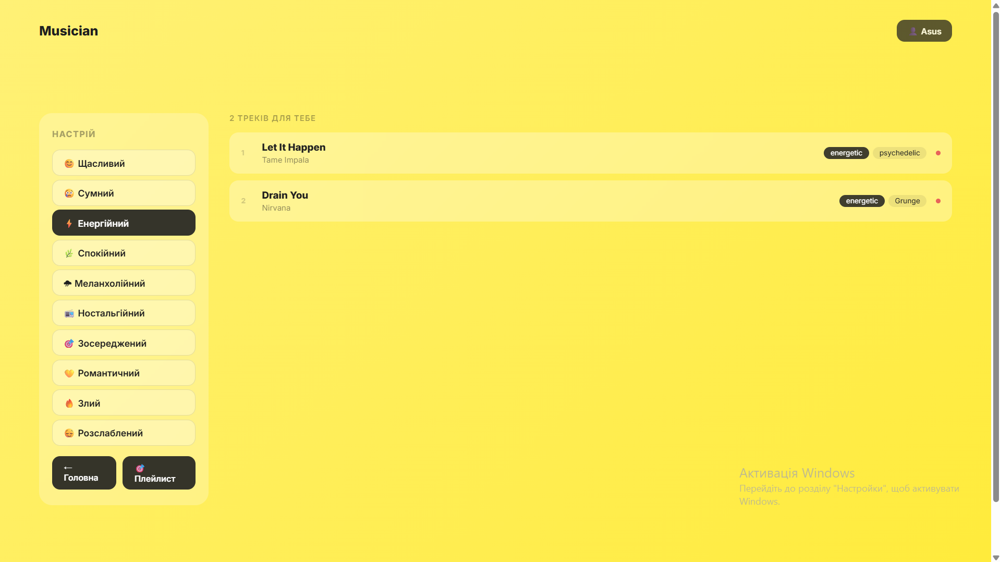

# Musician
Веб-додаток + Телеграм бот для підбору пісень із створеного користувачем плейлиста в залежності від його настрою

## Скріншоти додатку

1. Початкова сторінка


2. Реєстрація


3. Логін


4. Повністю верифікований профіль


5. Плейлист


6. Вибір пісень під настрій


## Стек технологій
- Веб-застосунок
    - **Backend:** Django, Python
    - **Databases:** Django ORM, MongoDB, PostgreSQL
    - **Cache:** Redis
    - **Frontend:** HTML, CSS, Chart.js

- Телеграм бот
    - **Struture:** Aiogram 3
    - **Databases:** Django ORM, MongoDB
    - **Cache:** Redis
    - **AI:** Google Gemini API
    - **Music API:** LastFM API

- Хостинг
    - **Веб-застосунок:** Render + UptimeRobot
    - **Телеграм-бот:** Render + UptimeRobot
    - **MongoDB:** MongoDB Atlas
    - **Redis:** Upstash
    - **PostgreSQL:** Render

## Функціонал
1. Реєстрація та авторизація користувачів
2. Додавання пісень через телеграм бот з автоматичним аналізом через АІ
3. Верифікація аккаунту через Телеграм бота
4. Перегляд плейлисту в Телеграм боті/Веб-застосунку
5. Перегляд детальної інформації про пісню через Телеграм бот
6. Видалення пісні через Телеграм бот
7. Перегляд статистики про ваш плейлист
8. Підбір музики по настрою

## Локальний запуск

1. Клонувати репозиторій
```bash
git clone https://github.com/daniyilamelin/Musician_App
```

2. Встановити залежності під кожну папку(app та telegram_bot)
```bash
pip install -r requirements.txt
```
3. Створити `.env` файл під кожну папку та заповнити своїми данними
    - app
        ```python
        MONGO_URI=
        GEMINI_AI_KEY=
        REDIS_URL=
        SECRET_KEY=
        POSTGRES_URL=
        MONGO_COLLECTION=
        MONGO_DATABASE=
        ```
    - telegram_bot
        ```python
        REDIS_URL=
        MONGO_URI=
        MONGO_DATABASE=
        MONGO_COLLECTION=
        BOT_TOKEN=
        GENAI_API_KEY=
        LASTFM_API_KEY=
        LASTFM_API_SECRET=
        DATABASE_URL=
        WEBHOOK_HOST=
        ```
4. В папці app запустити міграції
```bash
python manage.py migrate
```
5. Запустити все
    - app
        ```bash
        python manage.py runserver
        ```
    - telegram_bot
        ```bash
        python main.py 
        ```
## Демо
[Переглянути демо](https://musician-app-uv4h.onrender.com/)
